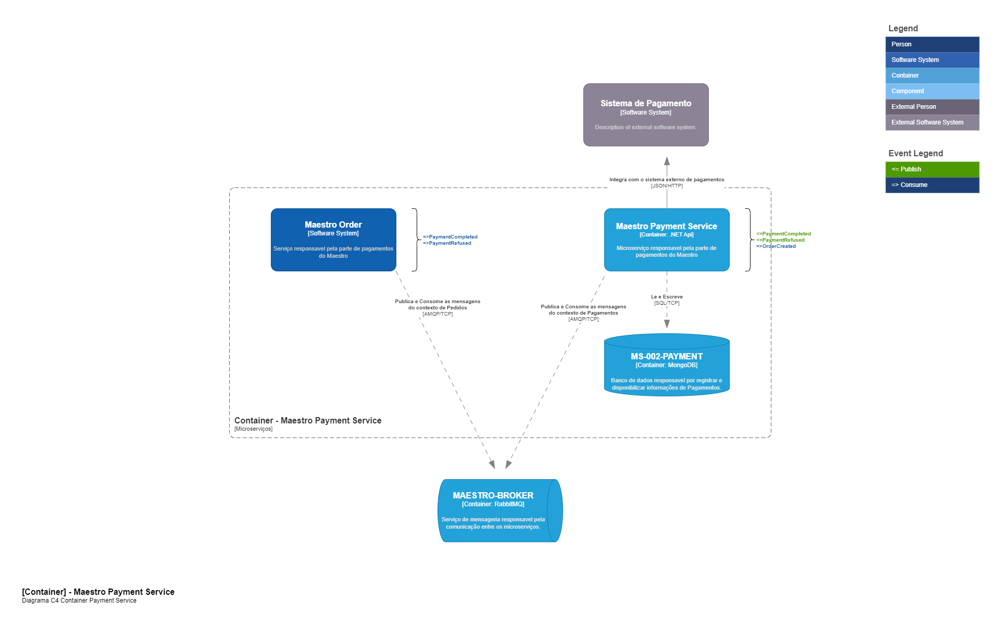
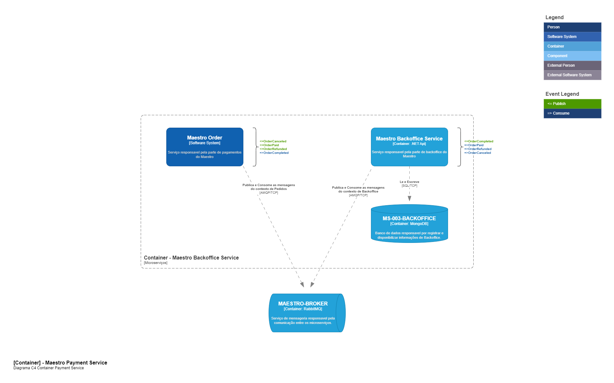

# Documentação Técnica Maestro 

A finalidade deste repositório é ser o centralizador da documentação da entrega da fase 5 do projeto Maestro. Os repositórios locais podem ser encontrados nos endereços abaixo.

| Microserviço          | Repositório                                       |
|-----------------------|---------------------------------------------------|
| Serviço de Pedidos    | https://github.com/pradofigu/ms-maestro-pedido    |
| Serviço de Pagamentos | https://github.com/pradofigu/ms-maestro-pagamento |
| Serviço de Backoffice | https://github.com/pradofigu/ms-maestro-producao  |


## Definições do Padrão Saga

Para esta entrega, definimos que o **Padrão Saga** que mais se adequa ao nosso cenário atual, é o padrão de Coreografia pela simplicidade do numero de microserviços envolvidos, o que com relação aos contras não teremos problemas, visto que pelo numero pequeno, não havera um acoplamento significamente grande entre o contexto envolvido e temos um pró da simplicidade do contexto. 

## Como executar este projeto

Todas as APIs e Infraestrutura estão disponivéis pelo nosso docker compose, então para subir todos os serviços executar o comando abaixo na raiz do projeto:

```bash
$ docker compose -f .\docker-compose.yaml up
```

## Documentação das Apis

Com os containers executando as documetações OpenAPI dos microserviços estão nestes endereços.


| Microserviço Pedido | Microserviço Pagamento | Microserviço Produção
|-----------------------------------------------------------------|--------------------------------------------------------------------|------------------------------------------------------------------
| [Documentação](http://localhost:5000/swagger/index.html) | [Documentação](http://localhost:5001/swagger/index.html) | [Documentação](http://localhost:5003/swagger/index.html)
|[](https://app.getpostman.com/run-collection/6860944-b9c0c083-2d8b-47db-98c4-535145b4efb6?action=collection%2Ffork&source=rip_markdown&collection-url=entityId%3D6860944-b9c0c083-2d8b-47db-98c4-535145b4efb6%26entityType%3Dcollection%26workspaceId%3D2b0eabd1-db13-423e-84cb-86664f28b99a)| [](https://god.gw.postman.com/run-collection/6860944-52134030-ca14-4f69-a8ff-8a21715f1042?action=collection%2Ffork&source=rip_markdown&collection-url=entityId%3D6860944-52134030-ca14-4f69-a8ff-8a21715f1042%26entityType%3Dcollection%26workspaceId%3D2b0eabd1-db13-423e-84cb-86664f28b99a)| [](https://god.gw.postman.com/run-collection/6860944-78772fa4-ded5-4026-8e22-503d3078dc2a?action=collection%2Ffork&source=rip_markdown&collection-url=entityId%3D6860944-78772fa4-ded5-4026-8e22-503d3078dc2a%26entityType%3Dcollection%26workspaceId%3D2b0eabd1-db13-423e-84cb-86664f28b99a)


## Arquitetura da Solução

A seguir é possivel conferir a modelagem da solução seguindo o [C4-Model](https://c4model.com/) de Arquitetura de Software.

### 00 - Apresentação do Sistema (Videos)

* [Apresentação Geral](https://drive.google.com/file/d/1YVCw_b4fVGyBwlW-HuM8fmDi1-5PMWOe/view?usp=sharing)

### 01 - Maestro System Context


### 02 - Maestro Container Pedidos


### 03 - Maestro Container Pagamentos



### 04 - Maestro Container Backoffice




## Relatórios OWASP ZAP

| Microserviço          | Antes | Depois |
|-----------------------|-------|--------|
| Serviço de Pedidos    | [Report](relatorio-owasp-zap/maestro-order/01%20-%20before/checkout-full-report.html)      | ... |
| Serviço de Pagamentos | [Report](relatorio-owasp-zap/maestro-payment/01%20-%20before/webhook-full-report.html)     | ... |
| Serviço de Backoffice | [Report](relatorio-owasp-zap/maestro-backoffice/01%20-%20before/cardapio-full-report.html) | ... |