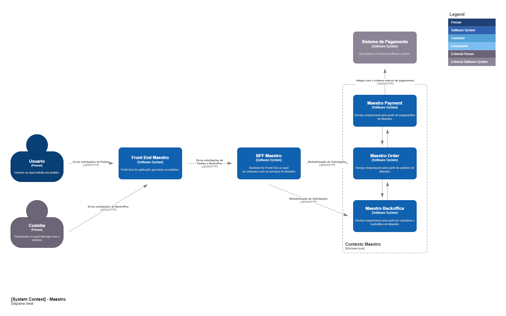
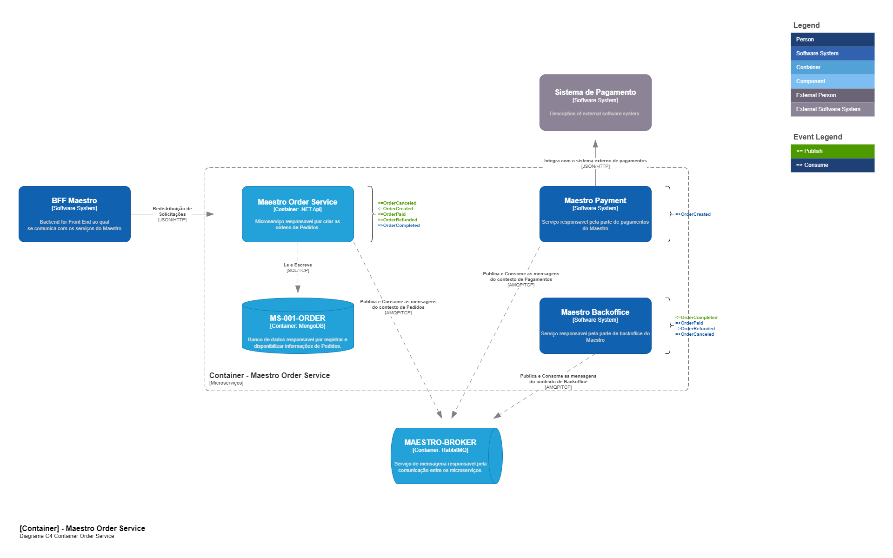

# Documentação Técnica Maestro 

A finalidade deste repositório é ser o centralizador da documentação da entrega da fase 5 do projeto Maestro. Os repositórios locais podem ser encontrados nos endereços abaixo.

| Microserviço          | Repositório                                       |
|-----------------------|---------------------------------------------------|
| Serviço de Pedidos    | https://github.com/pradofigu/ms-maestro-pedido    |
| Serviço de Pagamentos | https://github.com/pradofigu/ms-maestro-pagamento |
| Serviço de Backoffice | https://github.com/pradofigu/ms-maestro-producao  |

## Definições do Padrão Saga

Para esta entrega, definimos que o **Padrão Saga** que mais se adequa ao nosso cenário atual, é o padrão de Coreografia pela simplicidade do numero de microserviços envolvidos, o que com relação aos contras não teremos problemas, visto que pelo numero pequeno, não havera um acoplamento significamente grande entre o contexto envolvido e temos um pró da simplicidade do contexto. 

## Arquitetura da Solução

Abaixo segue a modelagem da nossa solução no modelo C4 de diagramação.

### 01 - Maestro System Context

### 02 - Maestro Container Pedidos

